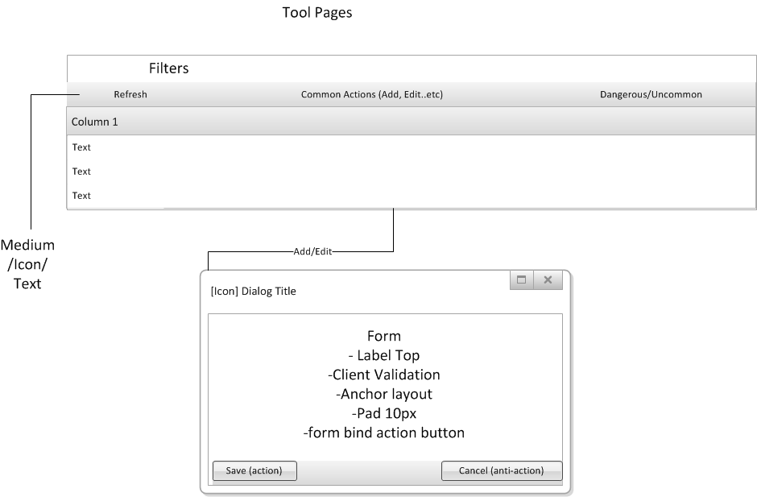

#User Interface Guide

##General Items
1. Remember this is a guide thier can be various as appropriate to the feature.  Focus on the usability and clear workflows.
2. Dialog bodys should be padded 10px
3. Use toolbar for actions and enable/disbable button to guide the user to valid actions.
4. Add text to icons on button so it's very clear as to what they are.  (Where possible)
5. Form action should be left to right with the Action on right and the anti-action on the left.  English is left to right.  Action should be common choise and the anti-action the uncommon.
6. Most windows should be resizeable they should adjust their layout accordingly.   Make sure window adjust to smaller screensizes.  Use the percentage where appropriate but remember IE 9 can have issue.  Making the window maximizable can resolve the issues.
7. Client should handle data rendering in most cases.
8. CSS should all be kept in the dynamic CSS file for branding.  However, page/feature specific styling can be approriate exceptionally if it's layout related specific to the page.
9. Use a top-level page on for direct linking.

